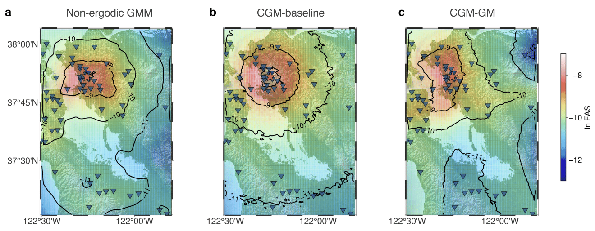

# :earth_americas: CGM-GM: Conditional Generative Models for Earthquake Ground Motions 

---

[](https://doi.org/10.1038/s41467-026-70719-2) [](https://arxiv.org/abs/2407.15089) [](https://doi.org/10.5281/zenodo.18480270)

> **[Nature Communications] Learning earthquake ground motions via conditional generative modeling**
> Pu Ren, Rie Nakata, Maxime Lacour, Ilan Naiman, Nori Nakata, Jialin Song, Zhengfa Bi, Osman Asif Malik, Dmitriy Morozov, Omri Azencot, N. Benjamin Erichson, and Michael W. Mahoney 

This repository provides the official implementation of **[CGM-GM](https://www.nature.com/articles/s41467-026-70719-2)**. We are also building a broader CGM family for geophysical applications: 

- **[CGM-FAS](https://arxiv.org/abs/2512.19909)**: conditional variational autoencoder models for Fourier amplitude spectra for modeling non-ergodic path effects
- **[CGM-Wave](https://www.stat.berkeley.edu/~mmahoney/pubs/Advancing_Broadband_Seismic_Wavefield_1.pdf)**: conditional diffusion models for high-fideliy broadband geothermal wavefields 
- **[CGM Overview](https://www.stat.berkeley.edu/~mmahoney/pubs/nakata-et-al-2025-feb-tle.pdf)**: a summary of our work on simulating seismic wavefields using generative AI 

---

## :fire: Updates 

- [03/2026] Our CGM-GM is published online by *Nature Communications*.
- [12/2025] CGM-FAS is online at arXiv. 
- [09/2025] Our CGM work is featured at **[SCEC2025 Plenary Talk](https://central.scec.org/publication/14399)**.
- [07/2025] Our CGM-Wave is accepted by *IEEE Transactions on Geoscience and Remote Sensing*.
- [02/2025] Our position paper (CGM Overview) is accepted by *The Leading Edge*.

---

## Overview

CGM-GM is a conditional generative modeling framework for synthesizing high-frequency, spatially continuous earthquake ground-motion waveforms. The model is designed to support seismic hazard assessment and infrastructure resilience studies by learning relationships between earthquake source information, source-station geometry, and observed ground-motion signals.

In this repository, CGM-GM uses earthquake magnitude together with source and station information as conditional inputs to generate waveform representations in the time-frequency domain and reconstruct them back to time-domain motion.

---

## Key features

- **Physics-aware conditional generation**: CGM-GM captures spatial heterogeneity and important physical characteristics of earthquake ground motions.
- **Flexible conditional inputs**: The code supports multiple conditioning settings, including rupture distance, azimuth-related geometry, source depth, and source/station coordinates.
- **Evaluation in multiple domains**: The workflow includes comparisons in both time and frequency domains, including waveform shape, arrival timing, and Fourier amplitude spectra (FAS).
- **Regional ground-motion mapping**: The repository includes utilities for generating waveform grids and producing FAS maps in the San Francisco Bay Area (SFBA).

Below is an example of generated FAS maps in the San Francisco Bay Area.

<p align="center">
  
</p>

---

## Code structure

```text
.
├── README.md
├── LICENSE
├── requirements.txt
├── get_data.py
├── train_hyperopt.py
├── test_best_model.py
├── generate_points.py
├── generate_wfs.ipynb
├── generate_fasmap.ipynb
├── asset/
│   └── fas_maps.png
├── model/
│   ├── dvae.py
│   └── losses.py
├── metrics/
│   ├── discrimanitive.py
│   └── visualization_metrics.py
└── utils/
    ├── utils.py
    └── utils_vis.py
```

- `train_hyperopt.py`: training script for CGM-GM with Hyperopt-based hyperparameter search.
- `test_best_model.py`: evaluation script for the selected model checkpoint.
- `generate_points.py`: waveform generation over a 100x100 grid for FAS-map simulations.
- `get_data.py`: dataset loading, preprocessing, normalization, and conditional-variable preparation.
- `generate_wfs.ipynb`: notebook for generating one or more waveforms from chosen conditional variables.
- `generate_fasmap.ipynb`: notebook for reproducing and visualizing FAS maps.
- `model/`: neural network architecture and loss definitions.
- `metrics/`: discriminative and visualization-oriented evaluation utilities.
- `utils/`: helper functions for plotting and general utilities.

---

## System requirements

### Hardware

The reported experiments were run on an NVIDIA A100 Tensor Core GPU with 40 GB memory.

### Operating system

The reported experiments were run on SUSE Linux Enterprise Server 15 SP5.

### Python environment

This project was developed with Python 3.9.17.

Install dependencies with:

```bash
conda create -n cgm_gm python=3.9.17
conda activate cgm_gm
pip install -r requirements.txt
```

---

## Data

The earthquake dataset for the SFBA was originally downloaded from [NCEDC](https://ncedc.org/). The training and testing data used in this study were preprocessed and are available through the DesignSafe data report:

- [DesignSafe project data](https://www.designsafe-ci.org/data/browser/public/designsafe.storage.published/PRJ-4573)

The preprocessing pipeline in this repository expects waveform tables such as `Time_Series_Data_v5_EW.csv`, where metadata columns are followed by waveform samples. During loading:

- the code keeps the EW component,
- trims the first 1000 samples,
- uses the remaining 6000 samples per waveform,
- converts waveforms to time-frequency representations with STFT,
- normalizes both waveform features and conditional variables to support model training.

---

## Usage

### 1. Train the model

Train CGM-GM with geospatial coordinates as conditional variables:

```bash
python train_hyperopt.py
```

Train the baseline variant using epicentral-distance-style conditioning:

```bash
python train_hyperopt.py --tcondvar 4
```

### 2. Evaluate the trained model

Run evaluation on the selected best model:

```bash
python test_best_model.py
```

### 3. Generate grid-based waveforms

Generate waveforms on a 100x100 grid for FAS-map analysis:

```bash
python generate_points.py
```

---

## Notebooks and examples

- Use `generate_wfs.ipynb` to generate single or multiple waveforms from specified conditional variables.
- Use `generate_fasmap.ipynb` to produce and compare FAS maps for CGM-GM, the baseline model, and the non-ergodic GMM.
- The dataset used in the paper for FAS-map examples is also provided via [Google Drive](https://drive.google.com/drive/folders/1FBldbGO7lk-BwmLNbW1ODUDL4M97ZdQO?usp=sharing).

---

## Evaluation notes

The evaluation pipeline includes comparisons of:

- waveform shape,
- P-wave and S-wave arrival timing,
- amplitude spectra,
- Fourier amplitude spectra maps.

This project uses [PhaseNet](https://github.com/AI4EPS/PhaseNet) for picking P-wave and S-wave arrival times in the evaluation workflow.

For reference, the implementations of the ergodic and non-ergodic GMMs for the SFBA are related to the methodology described in [this paper](https://pubs.geoscienceworld.org/ssa/bssa/article-abstract/113/5/2144/623913/Methodology-for-Including-Path-Effects-Due-to-3D?redirectedFrom=fulltext).

---

## Citation

If you find our research helpful, please consider citing our paper:

```bibtex
@article{cgm_gm_2026,
  author = {Ren, Pu and Nakata, Rie and Lacour, Maxime and Naiman, Ilan and Nakata, Nori and Song, Jialin and Bi, Zhengfa and Malik, Osman Asif and Morozov, Dmitriy and Azencot, Omri and Erichson, N. Benjamin and Mahoney, Michael W.},
  title = {Learning earthquake ground motions via conditional generative modeling},
  journal = {Nature Communications},
  year = {2026},
  url = {https://www.nature.com/articles/s41467-026-70719-2},
  doi = {10.1038/s41467-026-70719-2}
}
```

---

## License

This project is released under the GNU General Public License v3.0. See the [LICENSE](LICENSE) file for details.

---

## Contact

If you have any questions or comments, please feel free to contact me through email (puren1028 AT gmail DOT com).